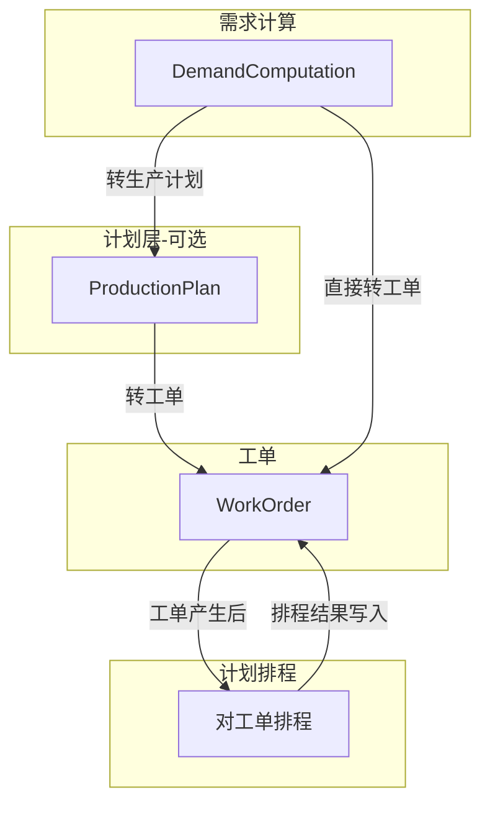

# 生产计划与计划排程设计

> 销售、计划、采购流程重组优化 - Phase 0 产出  
> 定义 ProductionPlan、Scheduling、WorkOrder 的数据流与页面改造

## 1. 核心定义：计划排程

**计划排程 = 对已存在的工单进行时间排程**

- 先有工单（来源：需求计算直接生成、生产计划转工单、手工创建等）
- 排程是对这些工单做时间安排：设置 `planned_start_date`、`planned_end_date`，在甘特图上调整顺序
- 不引入「计划工单」「待排程项」等额外实体

## 2. 数据流概览（简化后）

## 3. 生产计划（ProductionPlan）

### 3.1 来源

| 来源类型 | source_type | source_id | 说明 |
|----------|-------------|-----------|------|
| 需求计算 | DemandComputation | computation_id | 从需求计算「转生产计划」生成 |
| 手工创建 | null | null | 无来源，用于补货、备库、插单 |

### 3.2 与需求计算的关系

- 需求计算可执行「转生产计划」操作，生成一条 ProductionPlan
- ProductionPlan 仅能从上述两种来源产生，无其他来源

### 3.3 转工单

- 生产计划「转工单」：按计划明细生成正式工单
- 生成的工单可进入计划排程页面进行时间安排

## 4. 计划排程（Scheduling）

### 4.1 定义与数据来源

**排程 = 对已存在的工单进行时间安排**

- 数据来源：**工单**（status 为 pending、released 等待排程状态）
- 排程页面加载工单列表，在甘特图上拖拽调整 `planned_start_date`、`planned_end_date`

### 4.2 排程输出

- 更新工单的 `planned_start_date`、`planned_end_date`
- 不生成新单据，仅修改已有工单的计划时间

### 4.3 现有 Scheduling 页面改造

当前 [scheduling/index.tsx](riveredge-frontend/src/apps/kuaizhizao/pages/plan-management/scheduling/index.tsx) 有 MRP/LRP/Schedule/Gantt 四个 Tab。

**改造方案：**

| Tab | 改造后 |
|-----|--------|
| Tab1 待排程工单 | 加载 status 为待排程的工单列表 |
| Tab2 甘特图 | 工单排程拖拽、时间调整，结果写入工单 |
| Tab3 需求计算建议 | 保留为需求计算/生产计划的快捷入口（可选） |

### 4.4 排程计算的考虑因素（现状与规划）

| 因素 | 当前实现 | 说明 |
|------|----------|------|
| 优先级 | 已考虑 | 工单 priority 参与排序 |
| 交期 | 已考虑 | planned_end_date 参与排序 |
| 工作中心产能 | 未实现 | `_check_capacity` 当前固定返回 True，TODO 待实现 |
| 物料 | 未考虑 | 排程不校验物料齐套，缺料由需求计算/领料环节处理 |
| 设备 | 未考虑 | 设备可用性、换线时间等未接入排程算法 |
| 人员 | 未考虑 | 人员排班、技能匹配等未接入 |

**结论**：当前排程主要依据优先级和交期做启发式排序，物料、设备、人员均未参与。工作中心产能检查接口已预留但未实现。后续可扩展为多约束排程。

## 5. 接口约定

### 5.1 生产计划

- `POST /apps/kuaizhizao/demand-computations/{id}/push-to-production-plan`：需求计算转生产计划
- `POST /apps/kuaizhizao/production-plans/{id}/push-to-work-orders`：生产计划转工单

### 5.2 计划排程

- `GET /apps/kuaizhizao/work-orders`：获取工单列表（筛选待排程状态）
- `PUT /apps/kuaizhizao/work-orders/{id}`：更新工单计划时间（排程拖拽后保存）
