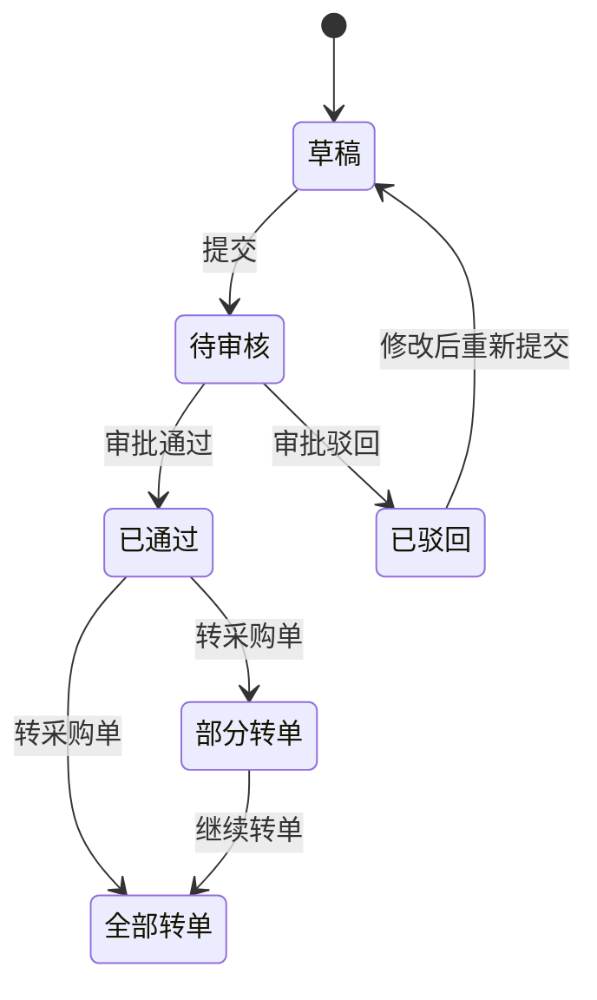

# 采购申请设计规范

> 销售、计划、采购流程重组优化 - Phase 0 产出  
> 定义 PurchaseRequisition 模型、审批、转单、紧急采购规则

## 1. 概述

采购申请（Purchase Requisition）作为需求计算与采购订单之间的可选中间层，支持审批、合并、选供应商等操作。是否经采购申请由流程开关 `require_purchase_requisition` 控制。

## 2. 状态流转

## 3. 审批

### 3.1 审批框架

- 复用现有 `ApprovalProcess` 审批框架
- 审批类型：`purchase_requisition`
- 未配置审批流程时：提交即视为通过，直接进入「已通过」状态

### 3.2 审批触发

- 采购申请「提交」时，若配置了审批流程，自动启动审批
- 审批通过后状态变为「已通过」，可执行「转采购单」

## 4. 转采购单

### 4.1 规则

- **手动转单**：审批通过后，用户手动点击「转采购单」，不自动转
- **合并转单**：支持多选采购申请行，合并生成一个采购单（按供应商分组）
- **按供应商分组**：同一供应商的采购申请行合并到同一采购单

### 4.2 转单后状态

- 采购申请行记录 `purchase_order_id`、`purchase_order_item_id`，标记已转单
- 采购申请头：若全部行已转单，状态可标记为「全部转单」；否则为「部分转单」

## 5. 紧急采购

### 5.1 场景

当流程开关 `require_purchase_requisition=true` 时，采购申请为必经环节。但存在紧急采购需求，需跳过审批直接生成采购单。

### 5.2 实现

- 采购申请详情页提供「紧急采购」按钮
- 点击后弹出对话框，**必填原因**（如「客户加急」「设备故障补件」）
- 确认后：跳过审批、直接生成采购单，并将原因写入审计日志

### 5.3 审计字段

采购申请表增加：

| 字段 | 类型 | 说明 |
|------|------|------|
| `is_urgent` | bool | 是否紧急采购 |
| `urgent_reason` | text | 紧急原因（紧急采购时必填） |
| `urgent_operator_id` | int | 紧急操作人 |
| `urgent_operated_at` | datetime | 紧急操作时间 |

审计日志记录：`{ "action": "urgent_purchase", "requisition_id": xx, "reason": "xxx", "operator": xx }`

## 6. 追溯

### 6.1 采购单来源

采购单的 `source_type` 支持：

- `DemandComputation`：直接由需求计算生成（流程开关关闭时）
- `PurchaseRequisition`：由采购申请转单生成

### 6.2 采购单行追溯

采购单行（PurchaseOrderItem）保留：

- `source_type`、`source_id`：上游单据类型与 ID
- `demand_computation_item_id`（可选）：关联需求计算明细，用于追溯到需求/销售订单

## 7. 模型概要

### 7.1 PurchaseRequisition（采购申请头）

- 租户、编码、状态、申请人、申请日期、要求到货日期
- 来源：`source_type`（DemandComputation）、`source_id`（computation_id）
- 紧急采购字段：`is_urgent`、`urgent_reason`、`urgent_operator_id`、`urgent_operated_at`

### 7.2 PurchaseRequisitionItem（采购申请行）

- 物料、数量、单位、建议单价、要求到货日期
- 来源：`demand_computation_item_id`
- 转单后：`purchase_order_id`、`purchase_order_item_id`
