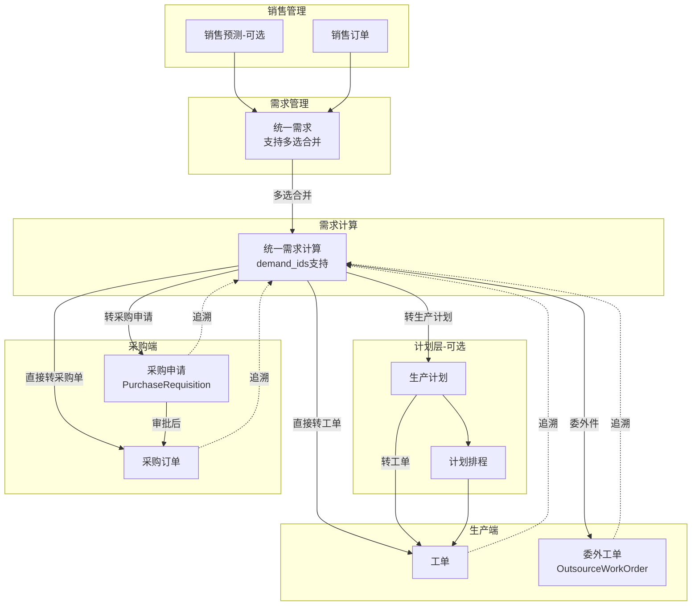

# 销售、计划、采购流程重组实施总结

> 基于思维导图重组销售、计划、采购流程，完善需求管理→需求计算→生产/采购的闭环  
> 实施日期：2025-02-02  
> 状态：✅ 全部完成

## 一、实施概览

本次重组按 4 个阶段完成，统一了 MRP/LRP 表述，扩展了需求计算产出路径，打通了生产计划与排程，实现了多需求合并与追溯功能。

## 二、各阶段实施详情

### Phase 1：术语与文档优化 ✅

#### 1.1 前端术语统一
**文件**：`riveredge-frontend/src/apps/kuaizhizao/pages/plan-management/demand-computation/index.tsx`

**变更**：
- 列标题：「计算类型」→「计算模式」
- 搜索筛选：`hideInSearch: true`，隐藏 MRP/LRP 术语暴露
- 展示值：保持「按预测」「按订单」业务表述

**影响**：用户界面不再直接看到 MRP/LRP 技术术语，降低学习成本。

#### 1.2 文档完善
- 术语表已在《☆ 用户使用全场景推演.md》中补充
- 流程路径配置规范已单独成文

---

### Phase 2：需求计算产出路径扩展 ✅

#### 2.1 转生产计划
**接口**：`POST /apps/kuaizhizao/demand-computations/{id}/push-to-production-plan`  
**实现**：`document_push_pull_service._push_computation_to_production_plan`

**功能**：
- 从需求计算生成 ProductionPlan
- 创建 source_type="DemandComputation" 的生产计划
- 建立单据关联关系

#### 2.2 转采购申请
**接口**：`POST /apps/kuaizhizao/demand-computations/{id}/push-to-purchase-requisition`  
**实现**：`document_push_pull_service._push_computation_to_purchase_requisition`

**功能**：
- 从需求计算生成 PurchaseRequisition（仅采购件）
- 支持审批流程（方案 B）
- 采购申请可转采购单

#### 2.3 委外下推（核心改进）
**文件**：`riveredge-backend/src/apps/kuaizhizao/services/demand_computation_service.py`

**变更**：
- 新增 `_create_outsource_work_order_from_item` 方法
- 委外件（Outsource）生成 `OutsourceWorkOrder`，不再生成普通工单
- 从 `material_source_config` 获取供应商信息：
  - `outsource_supplier_id`
  - `outsource_operation`
  - `outsource_price`

**前置条件**：委外件物料必须在物料主数据中配置 `source_config.outsource_supplier_id` 和 `outsource_operation`，否则创建失败并提示用户。

---

### Phase 3：生产计划与排程打通 ✅

#### 3.1 生产计划转工单
**接口**：`POST /apps/kuaizhizao/production-plans/{id}/push-to-work-orders`  
**实现**：`document_push_pull_service._push_production_plan_to_work_order`

**功能**：
- 从生产计划明细（suggested_action="生产"）生成工单
- 支持合并多条计划明细
- 建立单据关联关系

**文件变更**：
- `document_push_pull_service.py`：新增 `production_plan -> work_order` 下推场景
- `production.py`：新增 API 端点
- `production.ts`：新增 `planningApi.productionPlan.pushToWorkOrders`
- `production-plans/index.tsx`：新增「转工单」按钮

#### 3.2 生产计划定位
- 作为**可选中间层**，满足两种路径：
  - 极简路径：需求计算 → 直接生成工单
  - 全流程路径：需求计算 → 生产计划 → 转工单（或进排程）

---

### Phase 4：多需求合并与追溯 ✅

#### 4.1 数据模型扩展
**迁移文件**：`migrations/models/61_20260202000000_add_demand_ids_for_multi_demand.py`

**变更**：
- `DemandComputation.demand_ids`：JSONB，存储 `[int]`
- `DemandComputationItem.demand_item_ids`：JSONB，存储 `[int]`

**模型文件**：
- `models/demand_computation.py`：新增 `demand_ids` 字段
- `models/demand_computation_item.py`：新增 `demand_item_ids` 字段

#### 4.2 Schema 与验证
**文件**：`schemas/demand_computation.py`

**变更**：
- `DemandComputationBase.demand_id`：改为 Optional
- `DemandComputationBase.demand_ids`：新增 Optional[List[int]]
- 模型验证器：确保 `demand_id` 与 `demand_ids` 二选一

#### 4.3 多需求合并执行逻辑
**文件**：`services/demand_computation_service.py`

**变更**：
- `create_computation`：
  - 支持 `demand_id` 或 `demand_ids` 创建
  - 多需求时验证所有需求已审核
  - 自动推断计算类型（有订单则 LRP，全预测则 MRP）
  - 使用第一个需求作为主需求（向后兼容）
  
- `_execute_mrp_computation`：
  - 从 `computation.demand_ids` 或 `[computation.demand_id]` 获取需求列表
  - 合并所有需求的明细
  - 相同物料汇总数量，记录 `demand_item_ids` 用于追溯
  
- `_execute_lrp_computation`：
  - 同 MRP，支持多需求合并
  - 保留交货日期等 LRP 特有字段

#### 4.4 需求来源追溯接口
**新增服务**：`services/demand_source_chain_service.py`

**接口**：
- `GET /apps/kuaizhizao/work-orders/{id}/demand-source-chain`
- `GET /apps/kuaizhizao/purchase-orders/{id}/demand-source-chain`
- `GET /apps/kuaizhizao/purchase-requisitions/{id}/demand-source-chain`

**追溯链路**：
```
WorkOrder / PurchaseOrder / PurchaseRequisition
  → DemandComputation
    → Demand (多个)
      → SalesOrder / SalesForecast
```

**返回示例**：
```json
{
  "chain": [
    { "type": "WorkOrder", "id": 1, "code": "WO-20250202-0001" },
    { "type": "DemandComputation", "id": 1, "code": "MRP-20250201-001" },
    { "type": "Demand", "id": 1, "code": "D-001", "source_type": "sales_order", "source_id": 10 },
    { "type": "SalesOrder", "id": 10, "code": "SO-20250201-001" }
  ]
}
```

#### 4.5 前端多选需求创建
**文件**：`riveredge-frontend/src/apps/kuaizhizao/pages/plan-management/demand-computation/index.tsx`

**变更**：
- 选择需求：`ProFormSelect` 增加 `mode="multiple"`
- 状态管理：`selectedDemandId` → `selectedDemandIds: number[]`
- 计算类型推断：多需求时，有 MTO 则 LRP，全 MTS 则 MRP
- 创建请求：单需求用 `demand_id`，多需求用 `demand_ids`

**用户体验**：
- 支持多选需求合并计算
- 自动推断计算类型
- 提示合并需求数量

---

## 三、核心技术实现

### 3.1 委外工单创建流程

```python
# demand_computation_service._create_outsource_work_order_from_item
1. 从 item.material_source_config 获取供应商信息
2. 验证 outsource_supplier_id 存在
3. 查询 Supplier 获取 code 和 name
4. 构造 OutsourceWorkOrderCreate
5. 调用 OutsourceWorkOrderService.create_outsource_work_order
```

### 3.2 生产计划转工单流程

```python
# document_push_pull_service._push_production_plan_to_work_order
1. 获取生产计划及明细（suggested_action="生产"）
2. 确定生产模式（LRP → MTO，MRP → MTS）
3. 为每个明细创建 WorkOrder
4. 建立 production_plan -> work_order 单据关联
```

### 3.3 多需求合并计算流程

```python
# demand_computation_service.create_computation
1. 解析 demand_ids 或 [demand_id]
2. 验证所有需求已审核通过
3. 推断计算类型（有 MTO → LRP，全 MTS → MRP）
4. 使用第一个需求作为主需求（demand_id）
5. 存储 demand_ids 到 JSONB 字段

# _execute_mrp_computation / _execute_lrp_computation
1. 从 demand_ids 或 [demand_id] 获取所有需求
2. 合并所有需求的明细（DemandItem）
3. 相同物料汇总数量
4. 记录 demand_item_ids 用于追溯
5. 生成 DemandComputationItem
```

---

## 四、数据流总览（最终版）



---

## 五、关键文件清单

### 后端核心文件

| 模块 | 文件 | 变更类型 |
|------|------|---------|
| 需求计算服务 | `services/demand_computation_service.py` | 修改（委外工单、多需求） |
| 单据下推服务 | `services/document_push_pull_service.py` | 修改（生产计划转工单） |
| 需求来源追溯 | `services/demand_source_chain_service.py` | **新增** |
| 需求计算模型 | `models/demand_computation.py` | 修改（demand_ids） |
| 计算明细模型 | `models/demand_computation_item.py` | 修改（demand_item_ids） |
| 需求计算 Schema | `schemas/demand_computation.py` | 修改（demand_ids 验证） |
| 需求计算 API | `api/demand_computation.py` | 修改 |
| 生产 API | `api/production.py` | 修改（工单追溯、生产计划转工单） |
| 采购 API | `api/purchase.py` | 修改（采购单追溯） |
| 采购申请 API | `api/purchase_requisition.py` | 修改（采购申请追溯） |

### 前端核心文件

| 模块 | 文件 | 变更类型 |
|------|------|---------|
| 需求计算页面 | `pages/plan-management/demand-computation/index.tsx` | 修改（多选、术语） |
| 生产计划页面 | `pages/plan-management/production-plans/index.tsx` | 修改（转工单按钮） |
| 需求计算服务 | `services/demand-computation.ts` | 修改（demand_ids） |
| 生产服务 | `services/production.ts` | 修改（pushToWorkOrders） |

### 数据库迁移

| 迁移文件 | 说明 |
|---------|------|
| `60_20260201000000_create_purchase_requisition_tables.py` | 创建采购申请表 |
| `61_20260202000000_add_demand_ids_for_multi_demand.py` | 添加 demand_ids 和 demand_item_ids |
| `apply_demand_ids_migration.py` | 迁移执行脚本 |

---

## 六、使用指南

### 6.1 多需求合并计算

**操作步骤**：
1. 进入「需求管理」，勾选多个已审核通过的需求
2. 点击「新建计算」
3. 在弹窗中多选需求（支持混合销售预测和销售订单）
4. 系统自动推断计算类型：
   - 有销售订单 → 按订单计算（LRP）
   - 全销售预测 → 按预测计算（MRP）
5. 点击确定，生成需求计算

**效果**：
- 相同物料的需求数量自动汇总
- `demand_item_ids` 记录所有参与汇总的需求明细 ID

### 6.2 需求来源追溯

**工单追溯**：
```bash
GET /apps/kuaizhizao/work-orders/{id}/demand-source-chain
```

**返回示例**：
```json
{
  "chain": [
    { "type": "WorkOrder", "id": 1, "code": "WO-001" },
    { "type": "DemandComputation", "id": 1, "code": "MRP-001" },
    { "type": "Demand", "id": 1, "code": "D-001", "source_type": "sales_order", "source_id": 10 },
    { "type": "Demand", "id": 2, "code": "D-002", "source_type": "sales_forecast", "source_id": 5 },
    { "type": "SalesOrder", "id": 10, "code": "SO-001" },
    { "type": "SalesForecast", "id": 5, "code": "SF-001" }
  ]
}
```

**适用场景**：
- 工单详情页展示需求来源
- 采购单详情页展示需求来源
- 采购申请详情页展示需求来源

### 6.3 委外工单配置

**物料主数据配置**（委外件必需）：
```json
{
  "source_type": "Outsource",
  "source_config": {
    "outsource_supplier_id": 1,
    "outsource_supplier_name": "XX委外厂",
    "outsource_operation": "表面处理",
    "outsource_price": 10.5,
    "outsource_lead_time": 5,
    "material_provided_by": "enterprise"
  }
}
```

**验证规则**：
- `outsource_supplier_id` 必填
- `outsource_operation` 必填
- 供应商必须存在于供应商主数据

### 6.4 生产计划转工单

**操作步骤**：
1. 进入「生产计划」列表
2. 选择状态为「草稿」或「已审核」的计划
3. 点击「转工单」按钮
4. 确认后，系统为「建议行动=生产」的明细生成工单

**注意事项**：
- 仅生产类明细会转工单
- 采购类明细需单独处理（或通过执行计划生成采购单）

---

## 七、技术亮点

### 7.1 不割裂设计
- 同一套需求计算引擎，通过参数和来源区分 MRP/LRP
- 生产计划作为可选中间层，不强制使用
- 采购申请作为可选审批层，通过配置开关控制

### 7.2 向后兼容
- `demand_id` 单值保留，`demand_ids` 可选
- 单需求时仍用 `demand_id`，多需求时用 `demand_ids`
- 前端创建逻辑自动判断使用哪个字段

### 7.3 物料来源控制增强
- 委外件生成专用 `OutsourceWorkOrder`
- 采购件按供应商分组生成采购单
- 虚拟件自动跳过，直接展开下层物料

### 7.4 追溯链路完整
- 从工单/采购单可追溯到销售订单/预测
- 支持多需求来源展示
- 通过 `demand_item_ids` 精确定位需求明细

---

## 八、测试建议

### 8.1 单需求计算（回归测试）
- 创建单个销售预测 → 生成需求 → 需求计算 → 执行 → 生成工单/采购单
- 验证向后兼容性

### 8.2 多需求合并计算
- 创建多个销售预测/订单 → 生成需求 → 多选需求创建计算 → 执行
- 验证相同物料数量汇总
- 验证 `demand_item_ids` 记录正确

### 8.3 委外工单生成
- 配置委外件物料（含供应商）
- 需求计算 → 执行 → 一键生成
- 验证生成 `OutsourceWorkOrder` 而非普通工单
- 验证供应商信息正确填充

### 8.4 生产计划转工单
- 需求计算 → 转生产计划 → 生产计划转工单
- 验证工单生成及单据关联

### 8.5 需求来源追溯
- 调用追溯接口
- 验证链路完整性
- 验证多需求时返回多个 Demand 节点

---

## 九、已知限制与后续优化

### 9.1 委外工单前置条件
- **限制**：委外件必须配置供应商，否则创建失败
- **优化方向**：提供默认供应商或允许创建后补充

### 9.2 多需求执行逻辑
- **当前**：多需求合并时，相同物料汇总数量，记录 `demand_item_ids`
- **优化方向**：支持按需求明细独立展开（不汇总），便于精细追溯

### 9.3 前端追溯展示
- **当前**：后端接口已实现
- **待完成**：工单/采购单/采购申请详情页集成追溯链路展示组件

### 9.4 计划排程页面
- **当前**：排程页面存在，但与生产计划关联待完善
- **优化方向**：排程从生产计划或工单加载，排程结果写入工单

---

## 十、部署检查清单

- [ ] 执行数据库迁移：`python migrations/apply_demand_ids_migration.py`
- [ ] 验证委外件物料配置完整性
- [ ] 测试单需求计算（回归）
- [ ] 测试多需求合并计算
- [ ] 测试委外工单生成
- [ ] 测试生产计划转工单
- [ ] 测试需求来源追溯接口
- [ ] 前端功能测试（多选需求创建）
- [ ] 检查流程开关配置（可选）

---

## 十一、相关文档

- [☆ 用户使用全场景推演.md](./☆ 用户使用全场景推演.md)
- [多需求合并与追溯设计.md](./多需求合并与追溯设计.md)
- [流程路径配置规范.md](./流程路径配置规范.md)
- [生产计划与计划排程设计.md](./生产计划与计划排程设计.md)
- [采购申请设计规范.md](./采购申请设计规范.md)
